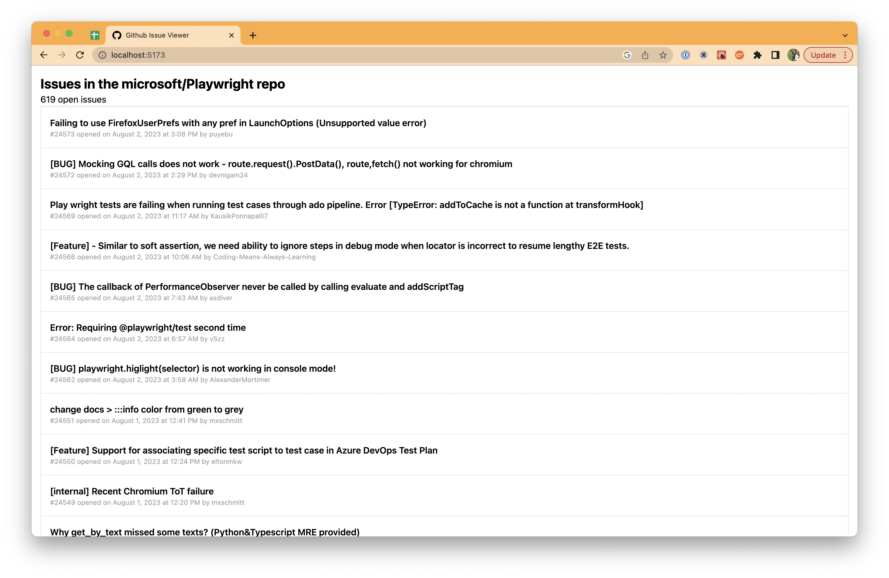

# Github Issue Viewer

A simple UI and backend to display issues from a github repo.

## Features

- Frontend written in React with Typescript; Backend is a very simple Flask app
- Backend calls Github's Search API, authenticating with personal access token if one is defined in the environment
- Frontend uses a context to fetch data from backend and potentially share with multiple components (currently only used by 1 component)
- Frontend is built with `Vite`
- Frontend tests use `vitest` and are are mocked with [MockServiceWorker](https://mswjs.io/)
- Backend tests use pytest
- Justfile provides simple commands for installing dependencies, starting servers, and running tests

## Local Installation

prerequisites: pyenv with Python 3.11.1 installed

1. Create a virtualenv called `github_issue_viewer`: `pyenv virtualenv 3.11.1 github_issue_viewer`. Once this has been created, the `.python-version` file in this repo should cause pyenv to auto-activate this virtualenv whenever you cd into this folder.
2. Install Just with homebrew, to enable running Just scripts: `brew install just`
3. Install all dependencies: `just install`
4. Start the backend: `just start_backend`
5. Start the frontend: `just start_frontend`
6. Visit `http://localhost:5176` to view!
